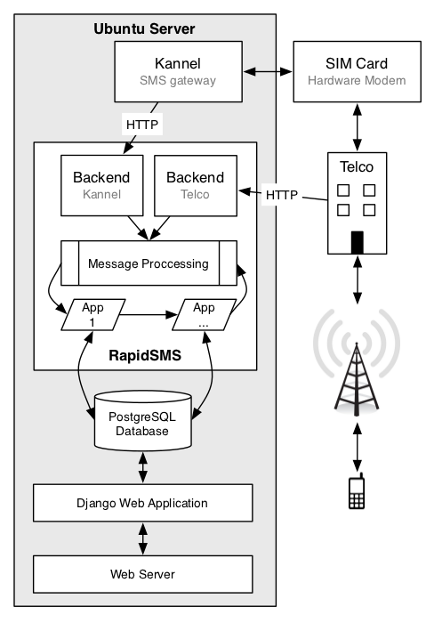

RapidSMS
================================================

----

RapidSMS
-------------------------------------------------

- Lightweight message processing framework
- Written in Python/Django

----

Installations
-------------------------------------------------

- Uganda
- Malawi/Zambia
- ChildCount

----

Setup
-------------------------------------------------

----

Benefits of RapidSMS
-------------------------------------------------

- Flexible framework
- Built on Django -- can easily build front-end web interfaces
- Can leverage reusable open source Django applications

----

Plans for the next year
-------------------------------------------------

- Lower barrier of entry for new developers
- Clean up core code and release 1.0
- Standardize app structure and think more about reuse

----

Lower Barrier of Entry
-------------------------------------------------

- Make installation easier
- Provide rich documentation and tutorials

----

Clean up core code
-------------------------------------------------

- Refactor router process to allow for pluggable architecture
- Help define and clean up contrib applications
- Write lots of tests

----

Scaling and Deployment
-------------------------------------------------

- Provide deployment examples
- Sending lots of SMS messages

----

Integration with external tools
-------------------------------------------------

- Standardized APIs
- Can reveal functionality through REST
